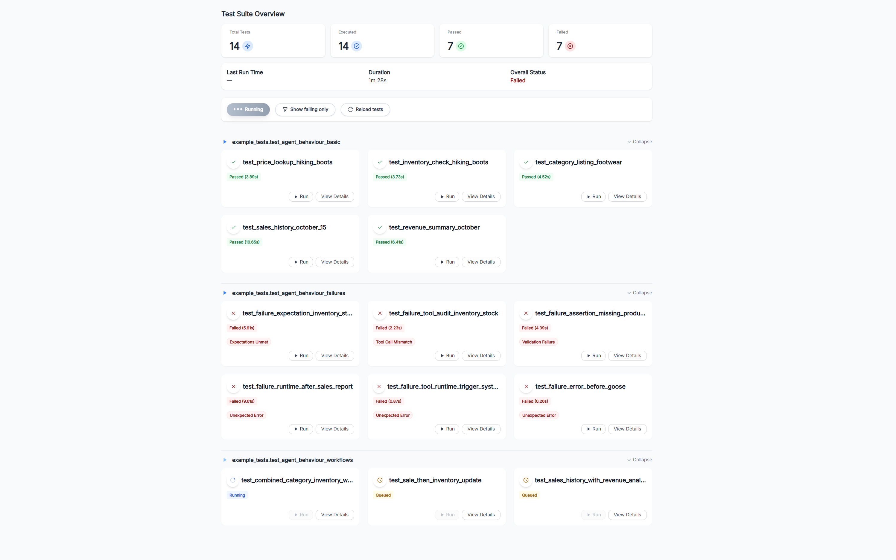
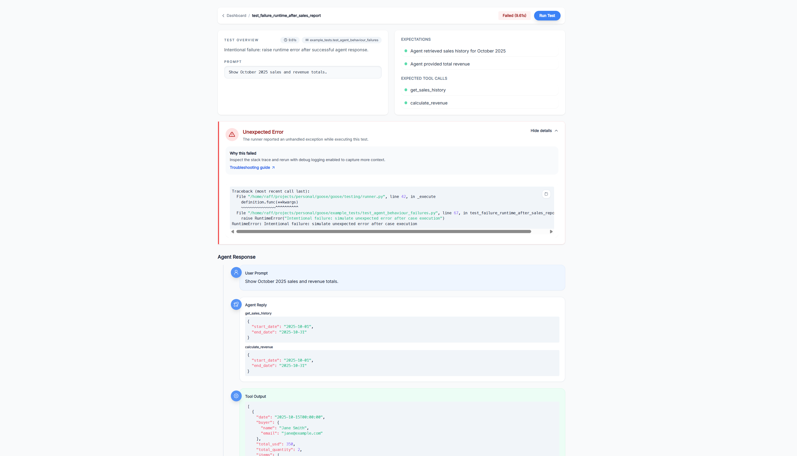

# Goose LLM 🪿

Goose is a batteries‑included **Python library and CLI** for validating LLM agents end‑to‑end. Currently designed for LangChain-based agents, with plans for framework-agnostic support in the future.

Design conversational test cases, run them locally or in CI, and (optionally) plug in a React dashboard – all while staying in Python.

Turn your “vibes‑based” LLM evaluations into **repeatable, versioned tests** instead of “it felt smart on that one prompt” QA.

## Why Goose?

Think of Goose as **pytest for LLM agents**:

- **Stop guessing** – Encode expectations once, rerun them on every model/version/deploy.
- **See what actually happened** – Rich execution traces, validation results, and per‑step history.
- **Fits your stack** – Wraps your existing agents and tools; no framework rewrite required.
- **Stay in Python** – Pydantic models, type hints, and a straightforward API.

## Install in your project 🚀

Install the core library and CLI from PyPI:

```bash
pip install llm-goose
```


## Quick Start: Minimal Example 🏃‍♂️

Here's a complete, runnable example of testing an LLM agent with Goose. This creates a simple weather assistant agent and tests it.

### 1. Set up your agent

Create `my_agent.py`:

```python
from typing import Any

from dotenv import load_dotenv
from langchain.agents import create_agent
from langchain_core.messages import HumanMessage
from langchain_core.tools import tool
from goose.testing.models.messages import AgentResponse

load_dotenv()

@tool
def get_weather(location: str) -> str:
    """Get the current weather for a given location."""
    return f"The weather in {location} is sunny and 75°F."

agent = create_agent(
    model="gpt-4o-mini",
    tools=[get_weather],
    system_prompt="You are a helpful weather assistant",
)

def query_weather_agent(question: str) -> AgentResponse:
    """Query the agent and return a normalized response."""
    result = agent.invoke({"messages": [HumanMessage(content=question)]})
    return AgentResponse.from_langchain(result)
```

### 2. Set up fixtures

Create `tests/conftest.py`:

```python
from goose.testing import Goose, fixture

from my_agent import query_weather_agent

@fixture(name="weather_goose") # name is optional - defaults to func name
def weather_goose_fixture() -> Goose:
    """Provide a Goose instance wired up to the sample LangChain agent."""

    return Goose(
        agent_query_func=query_weather_agent,
        validator_model=ChatOpenAI(model="gpt-4o-mini")
    )
```


### 3. Write a test

Create `tests/test_weather.py`. Fixture will be injected into recognized test functions. Test function and file names need to start with `test_` in order to be discovered.

```python
from goose.testing import Goose

def test_weather_query(weather_goose: Goose) -> None:
    """Test that the agent can answer weather questions."""

    weather_goose.case(
        query="What's the weather like in San Francisco?",
        expectations=[
            "Agent provides weather information for San Francisco",
            "Response mentions sunny weather and 75°F",
        ],
        expected_tool_calls=[get_weather],
    )
```


### 4. Run the test

```bash
# run help to get more information
goose-run --help

# tests is the name of the folder containing tests
goose-run run tests

# add -v / --verbose to stream detailed steps
goose-run -v run tests
```

That's it! Goose will run your agent, check that it called the expected tools, and validate the response against your expectations.

## Goose API & GUI

Install with extras:

```bash
pip install "llm-goose[api]"
```

Then launch the service from your project (for example, after wiring Goose into your own system):

```bash
# run help to get more information
goose-api --help

# start the API server (FastAPI + Uvicorn)
# example_tests is the name of the folder containing tests
goose-api example_tests
```

### React dashboard setup 🖥️

The React dashboard is a separate **web application** that talks to the Goose jobs API over HTTP.
It is built with Vite, React, and Tailwind and is designed to be run either locally during
development or deployed as a static site.

Install the published CLI from npm and let it host the built dashboard for you:

```bash
npm install -g @llm-goose/dashboard-cli

# run the dashboard
goose-dashboard

# or point the dashboard at your jobs API
GOOSE_API_URL="http://localhost:8000" goose-dashboard
```


For richer workflows (and the React dashboard), Goose ships an **example Django system** and a
**FastAPI jobs API**. These live in this repo only – they are not installed with the PyPI package – but
you can run them locally for inspiration or internal tooling.

On the dashboard, the **main grid view** shows one card per test in your suite, with a status pill
(`Passed`, `Failed`, `Queued`, `Running`, or `Not Run`), the most recent duration if it has been
executed, and any top‑level error from the last run. Toggling the "only failures" filter collapses the
grid down to just the failing tests so you can quickly see which checks are red, which have never
been executed, and which ones are currently running.



When you click into a test, the **detail view** shows a header with the test name, module path,
latest status and duration, plus the original docstring so you remember what the scenario is
meant to cover. Below that, an **execution history** lists each run as a card: you see every
expectation with a green check or red cross, along with the validator's reasoning explaining
why the run was considered a success or failure. For each step, the underlying messages are
rendered as human / AI / tool bubbles, including tool calls and JSON payloads; if something
went wrong mid‑run, the captured error text is shown at the bottom of the card.




## Writing tests ✅

At its core, Goose lets you describe **what a good interaction looks like** and then assert that your
agent and tools actually behave that way.

### Pytest-inspired syntax

Goose cases combine a natural‑language query, human‑readable expectations, and (optionally) the tools
you expect the agent to call. This example is adapted from
`example_tests/agent_behaviour_test.py` and shows an analytical workflow where the agent both
retrieves data and creates records:


```python
def test_sale_then_inventory_update(goose_fixture: Goose) -> None:
    """Complex workflow: Sell 2 Hiking Boots and report the remaining stock."""

    count_before = Transaction.objects.count()
    inventory = ProductInventory.objects.get(product__name="Hiking Boots")
    assert inventory is not None, "Expected inventory record for Hiking Boots"

    goose_fixture.case(
        query="Sell 2 pairs of Hiking Boots to John Doe and then tell me how many we have left",
        expectations=[
            "Agent created a sale transaction for 2 Hiking Boots to John Doe",
            "Agent then checked remaining inventory after the sale",
            "Response confirmed the sale was processed",
            "Response provided updated stock information",
        ],
        expected_tool_calls=[check_inventory, create_sale],
    )

    count_after = Transaction.objects.count()
    inventory_after = ProductInventory.objects.get(product__name="Hiking Boots")

    assert count_after == count_before + 1, f"Expected 1 new transaction, got {count_after - count_before}"
    assert inventory_after is not None, "Expected inventory record after sale"
    assert inventory_after.stock == inventory.stock - 2, f"Expected stock {inventory.stock - 2}, got {inventory_after.stock}"
```

### Custom lifecycle hooks

You can use existing lifecycle hooks or implement yours to suit your needs.
Hooks are invoked before a test starts and after it finishes.
This lets you setup your environment and teardown it afterwards.

```python
from goose.testing.hooks import TestLifecycleHook

class MyLifecycleHooks(TestLifecycleHook):
    """Suite and per-test lifecycle hooks invoked around Goose executions."""

    def pre_test(self, definition: TestDefinition) -> None:
        """Hook invoked before a single test executes."""
        setup()

    def post_test(self, definition: TestDefinition) -> None:
        """Hook invoked after a single test completes."""
        teardown()


# tests/conftest.py
from goose.testing import Goose, fixture
from my_agent import query

@fixture()
def goose_fixture() -> Goose:
    """Provide a Goose instance wired up to the sample LangChain agent."""

    model = ChatOpenAI(model="gpt-4o-mini")
    return Goose(
        agent_query_func=query,
        validator_model=model,
        hooks=MyLifecycleHooks()
    )
```

## License

MIT License – see `LICENSE` for full text.
