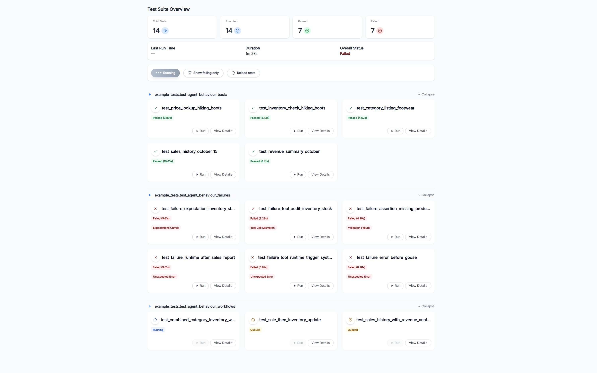
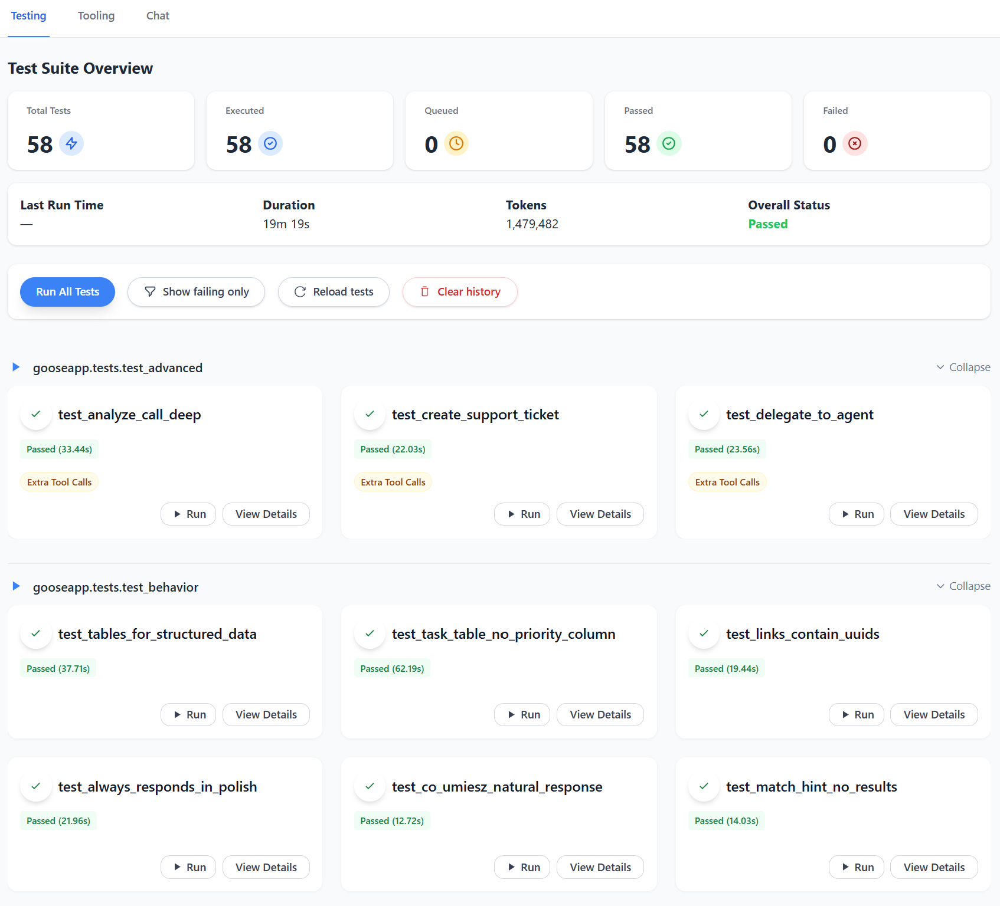
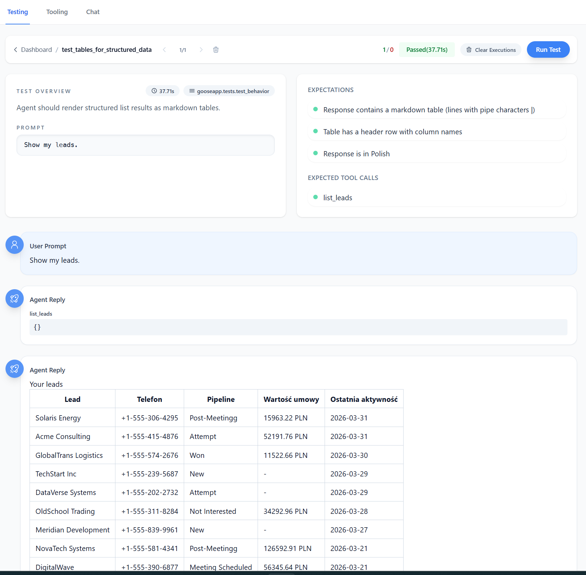
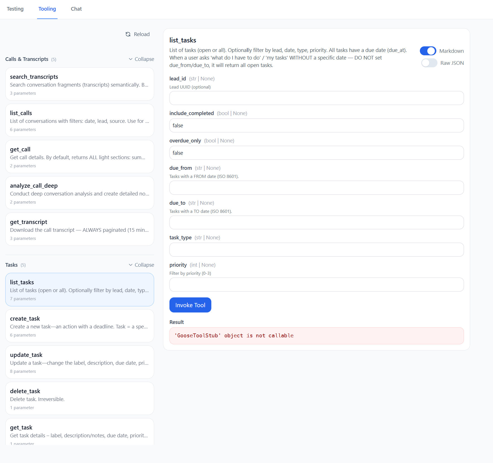
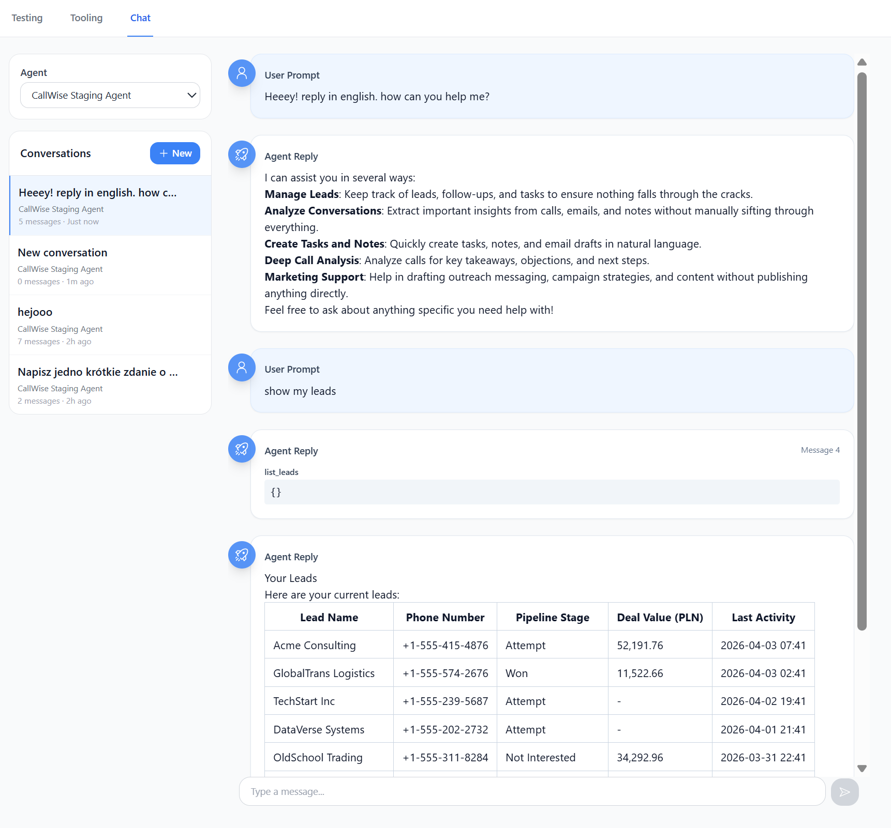

# Dashboard

The dashboard is the fastest way to move between failing tests, isolated tools, and live conversations.

Start it alongside the API:

```bash
goose api
goose-dashboard
```

By default:

- API: `http://localhost:8730`
- dashboard: `http://localhost:8729`

## Overview



The UI is organized around three workflows:

- **Testing** - validate cases and inspect traces
- **Tooling** - run one tool directly
- **Chatting** - replay a live conversation before you formalize it into a test

In the current React app, the visible tabs are **Testing**, **Tooling**, and **Chat**. The underlying backend
module is still `chatting`.

## Testing



Use Testing when you already have a case and need to answer:

- which tests passed or failed
- which case regressed most recently
- what the exact query, response, and tool path looked like

The main dashboard view gives you:

- run summary
- rerun controls
- per-test status
- quick drill-down into a single test

When a case fails, open the detail view:



That trace is where you read the failure in order:

1. the original query
2. the assistant response
3. tool calls and outputs
4. expectation results

If the expectations look correct but the tool path is wrong, jump to Tooling next.

## Tooling



Use Tooling when the problem is one function, not the whole agent.

This view lets you:

- pick a registered tool from `GooseApp(tools=[...])` or `tool_groups={...}`
- fill its arguments directly
- inspect the returned payload
- reload tool definitions after code changes

This is the shortest debugging path when the Testing trace already told you which tool misbehaved.

## Chatting



Use Chatting when you want to replay a real user flow before freezing it into a regression test.

This view is for:

- picking a configured agent
- creating or reopening conversations
- sending live prompts
- watching streamed tool activity inline

It is especially useful for edge cases that are not in `gooseapp/tests/` yet.

## How to read traces

A good Goose debugging loop is:

1. **Start in Testing** to confirm the failing case
2. **Open the trace** to see the exact tool calls and outputs
3. **Switch to Tooling** if one tool needs isolated reproduction
4. **Switch to Chatting** if you need to replay a broader live flow
5. **Go back to Testing** and rerun the case

In practice:

- expectation failure -> tighten the case or fix the response behavior
- wrong tool audit -> fix routing or tool selection
- bad tool output -> debug the tool in Tooling
- unclear real-world edge case -> explore it in Chatting, then turn it into a test

For the CLI side of the same workflow, see [`running-goose.md`](running-goose.md). For authoring the tests that
show up here, see [`testing.md`](testing.md).
